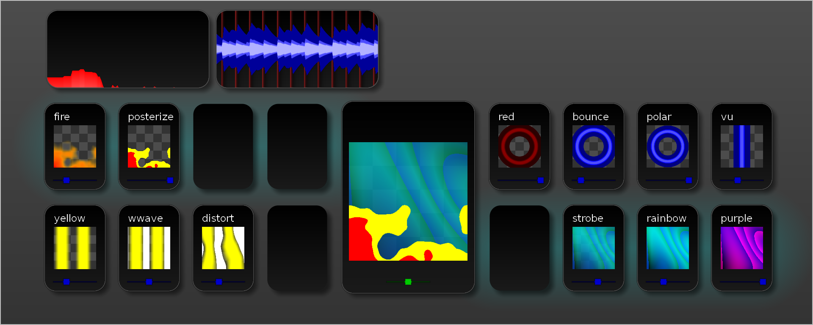

Radiance
========

LJ software for controlling light displays. Supports beat detection, MIDI controllers, and output over [lux](http://github.com/ervanalb/lux).

Screenshots
-----------

Build
-----

### Dependencies

- `SDL2`
- `SDL2-TTF`
- `PortAudio`
- `PortMIDI`
- `FFTW3`
- `libsamplerate`

Install dependencies on Ubuntu:

    $ sudo apt-get install libsdl2-dev libgl1-mesa-dev libsdl2-ttf-dev libportmidi-dev libfftw3-dev libsamplerate0-dev

Note: you may need to install a newer version of portaudio.

### Building Radiance

    git clone https://github.com/zbanks/radiance
    git submodule update --init
    cd radiance
    make
    ./radiance

If you `git pull` changes, make sure you also do `git submodule update` to pull in changes to `BTrack/`.

If you have issues building after pulling, try `make clean`.

Configuration
-------------

Resources accessed at run-time are stored in the `resources/` folder relative to the current directory. 

### Main Config: `resources/config.ini

Primary configuration file. Never reloaded while Radiance is running.

#### `[ui]`

Many of these constants are also duplicated in the UI GLSL code, so changing them here might not do what you want.

#### `[audio]`

Defines the constants/sizes used for processing audio. (FFT size, window lengths, etc.)

#### `[paths]`

Defines file path where to find the `params.ini` file (see below).

### Parameters: `resourses/params.ini`

Parameters that are OK to reload in without restarting radiance.

#### `[audio]`

Defines the filters that are applied to extract the highs, mids, lows, levels and draw the spectrum.

#### `[paths]`

Defines file paths for where to find other configuration files.

- `output_config` - Setup of output devices, e.g. LED strips
- `midi_config` - MIDI controller mappings. 
- `decks_config` - List of pre-defined pattern decks

#### `[debug]`

Debug parameters. Right now has `loglevel`, which sets the lowest loglevel. 

Example: set `loglevel=2` to suppress `DEBUG` messages. `loglevel=4` only shows `ERROR`/`FATAL` messages. `loglevel=0` shows all.

### Output Config: `resources/output.ini`

This file contains all of the configuration of output devices (e.g. LED strips): how to render them and how to send data to them.

Currently the only output type supported is `lux`, and the only device type is `lux_strip` though `lux_spot` is stubbed out but won't do much.

#### `[lux]`

Global lux configuration, currently just `timeout_ms`, which specifies the number of milliseconds to wait after sending a lux command expecting a response.

#### `[section_sizes]`

The *maximum* number of entries of each type has to specified in this section. 

#### `[lux_channel_##]`

*(Replace `##` with an index starting with 0 and less than `n_lux_channels`)*

A *lux channel* refers to a lux hub that's connecteded over USB. `uri` specifies the location, either a serial port (`serial:///dev/ttyUSB0`) or a UDP bridge address (`udp://127.0.0.1:1365`)

`sync` can be set to `1` to attempt to perform a syncronization step after each frame rendered across all the devices. (It doesn't work too well though)

#### `[lux_strip_##]`

- `address` - Lux ID. Can be a multicast address, e.g. `0xFFFFFFFF` to send to all devices (which would only work if you had exactly 1 device on the hub)
- `ui_name` - Human-readable name for this device, currently unused
- `ui_color` - Currently unused
- `max_energy` - Full-white is *very* bright, and some strips have trouble displaying it due to voltage drop across the strip. `max_energy` implements a "hard-knee compressor." Setting it to `1.0` or higher has no effect. Setting it to `0.7` causes a full `#FFFFFF` to be rendered as `#B2B2B2` (but `#FFFF00` stays `#FFFF00`)
- `gamma` - https://en.wikipedia.org/wiki/Gamma_correction
- `vertexlist` - Comma-separated list of verticies to draw the strips across. Domain is `-1.0` to `1.0`. Each vertex has *x*, *y*, and an optional *scale*. Scale can be used to change how densely the pixels are distributed across each line segment. The scale of the first vertex is unused. Ex `X1 Y1,X2 Y2,X3 Y3 S3`
` `quantize` - Merge individual pixels on the strip to make *n* giant pixels. `-1` to disable. `1` makes the entire strip solid (1 pixel).
- `oversample` - For each pixel in the output, average the values of *n* samples placed along the path. Must be `>= 1`. `1` is the basic nearest-neighbor sampling. Mostly used with `quantize` or LED spots.

### Deck Stack Config: `resources/decks.ini`

These are premade sets of decks to make it easier to load things in bulk. They are loaded by typing colon twice, folowed by the name of the deck.

Each line in the file defines a new deck. The left hand side defines the name, and the right is a space-separated list of patterns. Example:

    cingy=fire:1.0 rainbow:0.1 zoh:0.6 foh:0.5

The format is `name:intensity`, where intensity is a float between `0` and `1`. Use `\_` to skip a slot.

### MIDI Controllers; `resources/midi.ini`

This file contains a list of all of the supported MIDI controllers and how to map their MIDI events to actions in the UI.

#### `[section_sizes]`

The *maximum* number of entries of each type has to specified in this section. 

#### `[controller_##]`

- `name` - The exact name of the controller as it is detected by PortMIDI. This is used to detect which configuration to use.
- `snap` - Set to a unique non-zero integer (e.g. `1`) to enable "soft-snap" to sync the physical and virtual sliders.
- `cc_##` - This maps MIDI Control Change events to sliders on the UI. 1-16 are pattern intensity sliders, 18 is the crossfader, and 20 is the global volume (if that ever gets implemented...)
- `note_##` - This maps MIDI Note On/Off events to keys. When the MIDI button is pressed, the corresponding keystroke is sent to the UI. (Note: this code is terrible, and doesn't support modifier keys. `J` wil not do anything.)

Keyboard Shortcuts
------------------

### Movement
- *arrow keys* / `hjkl` - Change selected item
- Space - Select the crossfader
- Escape - Deselect everything
- Tab - Select the next pattern in the deck
- Shift-Tab - Select the previous pattern in the deck
- Home / `^` - Select the first pattern in the deck
- End / `$` - Select the last pattern in the deck

### Sliders
- Shift-Down / `J` - Decrement selected slider by 10%
- Shift-Up / `K`  - Increment selected slider by 10%
- `` ` ``, `0-9` - Set selected slider. `` ` `` = 0%; `1` = 10%; `5` = 50%; `0` = 100%

### Patterns
- Delete / `d` - Delete the currently selected pattern
- `:` - Load pattern (*see below*)

### Decks
- `[` - Flip between the two left decks
- `]` - Flip between the two right decks
- Enter - Flip between the two decks on the highlighted side

### Other
- `q` - Cycle through strip indicator: None, Solid, or Colored.
- `R` - Reload the MIDI & output configuration

### Loading Patterns
Hitting colon (`:`) when a pattern is selected brings up a textbox to enter a pattern name. 
This can be used to do 3 things:

- Typing the name of a pattern (ex. `vu`) then hitting Enter causes the named pattern to be loaded into the highlighed slot.
- Hitting Enter immediately causes the existing pattern to be reloaded.
- Typing `:` again, followed by the name of a deck and Enter causes the deck to be loaded (ex. `:vurain`)

Patterns
--------

### Full List
(Generated with ``$ head -n1 resources/patterns/*.0.glsl | xargs -d\n -n3 echo | grep '== //' | sed -e 's|==> \(.*\).0.glsl <== // \(.*\)$|- `\1` - \2|'`` )

- `allwhite` - Basic white fill 
- `black` - Reduce alpha 
- `bounce` - Zoom in (bounce) to the beat & audio 
- `bstrobe` - Full black strobe. Intensity increases frequency 
- `bwave` - Black sine wave from left to right. 
- `circle` - Yellow blob that spins to the beat 
- `cyan` - Cyan diagonal stripes 
- `desat` - Desaturate (make white) 
- `desatb` - Desaturate to the beat 
- `diodelpf` - Apply smoothing over time with new hits happening instantly 
- `distort` - Distort the screen to the beat 
- `dwwave` - Diagonal white wave 
- `edge` - Spatial edge detect filter (HPF) 
- `edgy` - Fake edge detection based only on alpha 
- `fire` - Fire from the bottom 
- `fireball` - Fileball in the center 
- `flow` - Radiate color from the center based on audio 
- `foh` - First order (expontential) hold 
- `heart` - Pink heart 
- `hue` - Shift the color in HSV space 
- `lpf` - Smooth output 
- `pink` - Pink polka dots 
- `pixelate` - Pixelate/quantize the output 
- `polar` - Convert vertical lines to rings 
- `posterize` - Reduce number of colors 
- `purple` - Organic purple waves 
- `qcircle` - Big purple soft circle  
- `rainbow` - Cycle the color (in HSV) over time 
- `red` - Change the color (in HSV) to red 
- `resat` - Recolor output with noise rainbow 
- `rjump` - Shift the hue on the beat 
- `rotate` - Rotate the screen 
- `slide` - Slide the screen left-to-right 
- `smoke` - Perlin noise green smoke 
- `speckle` - Per-pixel twinkle effect 
- `starfield` - Pixels radiating from the center 
- `stripey` - Vertical stripes with a twinkle effect 
- `strobe` - Strobe alpha to the beat 
- `swipe` - Only update a vertical stripe that slides across
- `test` - A green & red circle in the center 
- `vu` - Blue vertical VU meter 
- `wave` - Green and blue base pattern 
- `wstrobe` - White strobe to the beat 
- `wwave` - White wave with hard edges 
- `yellow` - Yellow and green vertical waves 
- `zoh` - Zero order hold to the beat

#### Base patterns

These patterns produce something visually interesting without anything below them.

- `allwhite` - Basic white fill 
- `circle` - Yellow blob that spins to the beat 
- `cyan` - Cyan diagonal stripes 
- `dwwave` - Diagonal white wave 
- `fire` - Fire from the bottom 
- `fireball` - Fileball in the center 
- `heart` - Pink heart 
- `pink` - Pink polka dots 
- `purple` - Organic purple waves 
- `qcircle` - Big purple soft circle  
- `smoke` - Perlin noise green smoke 
- `test` - A green & red circle in the center 
- `vu` - Blue vertical VU meter 
- `wave` - Green and blue base pattern 
- `wstrobe` - White strobe to the beat 
- `wwave` - White wave with hard edges 
- `yellow` - Yellow and green vertical waves 

These patterns are a subset of the above and most commonly used as the first pattern in a deck.

- `cyan` - Cyan diagonal stripes 
- `fire` - Fire from the bottom 
- `fireball` - Fileball in the center 
- `heart` - Pink heart 
- `pink` - Pink polka dots 
- `purple` - Organic purple waves 
- `smoke` - Perlin noise green smoke 
- `test` - A green & red circle in the center 
- `vu` - Blue vertical VU meter 
- `wave` - Green and blue base pattern 
- `yellow` - Yellow and green vertical waves 

#### Tail patterns

These patterns reduce visual complexity, or at least provide smoothing.

- `desat` - Desaturate (make white) 
- `desatb` - Desaturate to the beat 
- `diodelpf` - Apply smoothing over time with new hits happening instantly 
- `edge` - Spatial edge detect filter (HPF) 
- `edgy` - Fake edge detection based only on alpha 
- `flow` - Radiate color from the center based on audio 
- `foh` - First order (expontential) hold 
- `lpf` - Smooth output 
- `pixelate` - Pixelate/quantize the output 
- `posterize` - Reduce number of colors  (Note: looks bad on strips!)
- `red` - Change the color (in HSV) to red 
- `speckle` - Per-pixel twinkle effect 
- `starfield` - Pixels radiating from the center 
- `stripey` - Vertical stripes with a twinkle effect 
- `zoh` - Zero order hold to the beat
